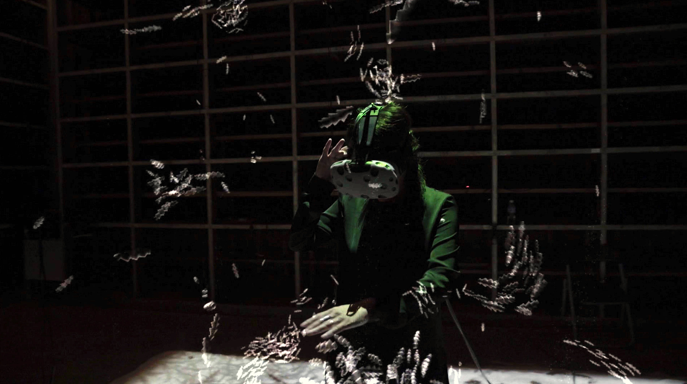
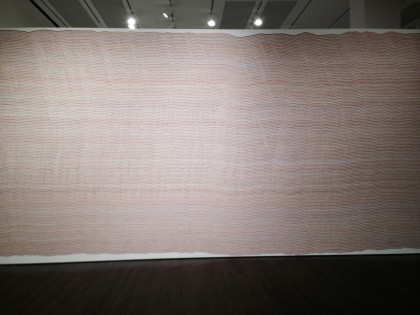
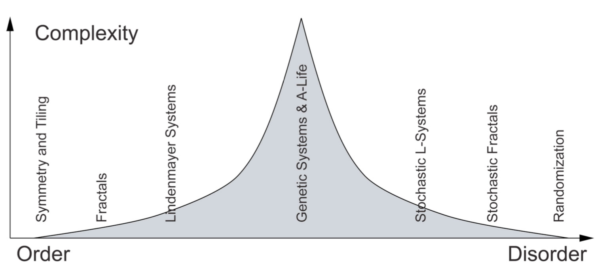

# Spatial Computing in Responsive Environments

*Also known as "Generative Art in Mixed Reality" (both titles are used in York U course catalogs)*

**Synopsis:** This practice-based course develops computationally literate art practices addressing 3D spaces of mixed reality as creative media, applying the interactive malleability of computation to understand, create and imagine new kinds of artistic, responsive, and generative worlds. That is, it addresses the spatialization of interactive computation, such that every part of peripersonal space around participants, in physical and virtual worlds, is rife with responsive behaviour.

[Zoom meeting](https://yorku.zoom.us/j/94516869391?pwd=cWEyN0JIUFAvYU9xdmVmUXBhdXlxdz09), Tuesdays, 1pm, beginning September 14.

<!-- **[Class video recordings](https://drive.google.com/drive/folders/1ugOFYW7sSkKypBPf_m7uCXDhz0GX8Cg8?usp=sharing)** -->

[Course information](course.html)

Instructor: [Graham Wakefield](https://ampd.yorku.ca/profile/graham-wakefield/) grrrwaaa at york u dot ca

[2021 Project: WebXR Studio](project.html)

<!--  -->

| Week                        | Class   | Due | Reading |
| :--                         | :--     | :-- | :--     |
| Sep 14: [Week 1](#week-1)   | [Overview](course.html), [Project](project.html), [Three.js](three.html) | [Survey](https://forms.gle/aMokgKGcSbigzbwf6) | [Read: Ivan Sutherland - The Ultimate Display (1965)](https://my.eng.utah.edu/~cs6360/Readings/UltimateDisplay.pdf)   [Listen: Jaron Lanier Voices of VR Podcast](https://voicesofvr.com/600-jaron-laniers-journey-into-vr-dawn-of-the-new-everything/) |
| Sep 21: [Week 2](#week-2)   | [Intro to VR](vr.html), [Project Planning](project.html), [Three.js topics](three.html) | Three.js sketches; questions |
| Sep 28: [Week 3](#week-3)   | Development sprint | Project prototypes show & tell, questions/roadblocks/etc |
| Oct 05: [Week 4](#week-4)   | Dev Milestone MVP: A telematic world, OCAD U demo? | MVP Milestone |
| Oct 12: [Reading Week](#reading-week)   | Team planning | Project updates |
| Oct 19: [Week 5](#week-5)   | Distributed objects, OCAD U demo? | Project updates |
| Oct 26: [Week 6](#week-6)   | Development sprint | Project updates |
| Nov 02: [Week 7](#week-7)   | Dev Milestone: Improvising worlds | Milestone |
| Nov 09: [Week 8](#week-8)   | Generative Art, Artificial Nature | Project updates |
| Nov 16: [Week 9](#week-9)   | Tech topic | Project updates |
| Nov 23: [Week 10](#week-10)   | Development sprint | Project updates |
| Nov 30: [Week 11](#week-11)   | Dev Milestone: Online Gallery | Milestone |
| Dec 07: [Week 12](#week-12)   | Exhibition Opening | Launch |
| Dec 14:  | | Final Paper |

-----

### Week 1

- [Course overview](course.html)
- This year's project: ["WebXR Studio"](project.html)
- **Break:** **[Please complete this survey](https://forms.gle/aMokgKGcSbigzbwf6)**
- Sign up for a free account on [Github](https://github.com) (if you haven't already got one), and then connect it to [Stackblitz](https://stackblitz.com). 
- First coding with [Three.js](three.html)
- Homework: 
  - Build your first Three.js scene! Use the [Three.js docs](https://threejs.org/docs/) to explore the possibilities
  - [Read: Ivan Sutherland - The Ultimate Display (1965)](https://my.eng.utah.edu/~cs6360/Readings/UltimateDisplay.pdf)   [Listen: Jaron Lanier Voices of VR Podcast](https://voicesofvr.com/600-jaron-laniers-journey-into-vr-dawn-of-the-new-everything/)
  - [Please complete this survey](https://forms.gle/aMokgKGcSbigzbwf6)!

- [Zoom recording](https://yorku.zoom.us/rec/share/zBHcbySo3OQ2TbiUDEETjebBYdTk1zxvIJhkL1FcOJkWEW_v3uITc4WI6Mcofc83.0avGR5hcfZM4p9TY)

### Week 2

- [An introduction to VR](vr.html): history, psychology, technology, art
- Discussion incl. reading/listening materials
- Project planning
- Coding
  - [https://threejsfundamentals.org/](https://threejsfundamentals.org/) -- great resource, if slightly out of date on some aspects
  - [How to update things](https://threejs.org/docs/#manual/en/introduction/How-to-update-things)
  - [How to remove things](https://threejs.org/docs/#manual/en/introduction/How-to-dispose-of-objects)
  - More [Three.js](three.html)

**Homework**

- Please update the [shared google brainstorm doc](https://docs.google.com/document/d/1328XZqjSkB2JyqNE_EtBIMScVHjwK7qVT0Jdyfvg14A) with your name to identify what area you will focus on over the week. 
- You can coordinate in teams via Discord!
- Please work on at least one of these:
  - Code: building up a proof-of-concept sketch for aspect of the topic
  - Survey: collecting reference URLs for existing example scripts, or external libraries, that can respond to the challenge
  - Research: collecting ideas and/or related work references that can inform this aspect
- Please add to the shared doc links to any codepen or stackblitz scripts, URLs for libraries, or for reference materials as appropriate.
 
- [Zoom recording](https://yorku.zoom.us/rec/share/kkrFcJ311TJegl8JulTeeJluena97W44i_onEIU_wWM1HpF4Io-TmOW-l39WqecF.VK4HRiseJ5WXRd2i)

## Week 3

- Development sprint

Graham's prototypes:
- [https://github.com/worldmaking/nodelab](https://github.com/worldmaking/nodelab) as a very simple demonstration of sharing multiple users' states. Set up as a re-usable script
- a more complex scene, linked to a github, at [https://stackblitz.com/edit/web-platform-re4a34](https://stackblitz.com/edit/web-platform-re4a34)
- (with Haru Ji, OCAD U): a pseudo-gallery hosting p5.js sketches at [https://stackblitz.com/edit/web-platform-mbcqax](https://stackblitz.com/edit/web-platform-mbcqax)

<!--

- All about VR and [WebXR](webxr.html) 

Technical baseline / template / engine to provide all the basic requirements for a project
High-level “blocks” (education materials, and/or components) to build common needs quickly
Server compute to negotiate shared experiences. Suggest Node.js capability to keep things in a single language.
Now WebXR requires secure HTTPS hosting and other security settings (e.g. allow=”vr” on iframe). That means we need a bit more framing setup to get custom projects going. (These challenges also hold for anything that is exporting to web (unity etc.))
How to hyperlink between sites (even on different domains) without exiting VR? (This was possible in WebVR, haven’t tested WebXR yet)
Hot loading assets is fairly straightforward, but how to hot-load code in an XR session? Basic capacity exists in JS (new Function etc.) but some software design needed. 
Assets have to download / stream to client. Better to structure experience such that waiting is minimized, and background load things that aren’t needed immediately. (Like 90’s web). 

### Week 4

**Milestone A: Minimum Viable Product**

## What is Generative Art? 

*...and Generative Music, Generative Architecture, etc...*

> Generative Art refers to any art practice where the artist uses a system, such as a set of natural language rules a computer program, a machine, or other procedural invention, which is then set into motion with some degree of autonomy to or resulting in a complex work of art (Philip Galanter).

> "Generative art is a term given to work which stems from concentrating on the processes involved in producing an artwork, usually (although not strictly) automated by the use of a machine or computer, or by using mathematic or pragmatic instructions to define the rules by which such artworks are executed." Adrian Ward, 1999, on the eu-gene mailing list welcome page.

> "In essence, all generative art focuses on the process by which an artwork is made and this is required to have a degree of autonomy and independence from the artist who defines it." [McCormack, Jon, Oliver Bown, Alan Dorin, Jonathan McCabe, Gordon Monro, and Mitchell Whitelaw. "Ten questions concerning generative computer art." Leonardo 47, no. 2 (2014): 135-141.](http://jonmccormack.info/wp-content/uploads/2012/10/TenQuestionsV3.pdf)

> See [more definitions here](http://www.generative.net/read/definitions)

**Q:** How do you make art outside your own control?

**Autonomous systems** used in generative art have included:

- sets of rules or procedures: algorithms and games
- geometries and symmetries
- abstract mathematical or logical models
- mechanics and kinetics
- materials behaviors (such as fluid flow or chemical reactions)
- relationships and navigations in huge data-sets
- randomization, probability, statistics
- interactions between, and interpretations by, multiple agents

**Not just with computers.** Although "Generative Art" is often used to refer to computer-generated artwork that is algorithmically determined, the definition makes no reference of computers, and arguably generative artworks have existed throughout human history. Composers used strict rule systems (the counterpoint of Bach, the serialism of Schoenberg) as well as chance (the dice-game of Mozart and chance operations of Cage). Pointilism, cubism, and other abstractions in painting are rule-based constraints. Many art theorists refer to Sol LeWitt's textual instructions, to be carried out by others; a direction also explored in alternative scores in music. One might also mention kinetic sculpture and generative texts (particularly the Oulipo group), or the pattern-based arts of Islamic tiling and weaving, Celtic knots, and other traditional arts.

 

**Is all art generative?** The term generative is usually used for art in which these systems play a major role in the work, with significant autonomy from the artist's urges. **Q:** Is procedural content generation generative art?

**Computational technology revolutionized generative art.** The computer brings new ideas and possibilities that were previously been impossible or impractical to realise -- making it *qualitatively* different. Notably, a great deal of the earliest computer art was also generative. **Q:** Is generative art is one of the most essential forms of computational art? **Q:** What are the most singular features of computational media -- that is, what differentiates it from most other media?

### Complexity 

[Galanter, Philip. "What is generative art? Complexity theory as a context for art theory." In In GA2003–6th Generative Art Conference. 2003.](http://philipgalanter.com/downloads/ga2003_what_is_genart.pdf) Galanter locates generative art in terms of scientificy complexity theory, placing it at the peak of complexity in the order/disorder spectrum, where information processing is maximised, and both entropy and compressibility are minimized. This is comparable to the peak in physical complexity between orderly and chaotic matter, where the organizations of living systems are found. 

Please read these papers and formulate your thoughts and questions for next week. Two volunteers are needed to lead focused discussions on each of them. That means bringing some in depth insights drawn from the reading, and one or more questions to spark conversation in class about them.

	- [Sutherland, Ivan E. "The ultimate display." Multimedia: From Wagner to virtual reality (1965): 506-508.](http://worrydream.com/refs/Sutherland%20-%20The%20Ultimate%20Display.pdf). [Also here](reading/Sutherland - The Ultimate Display.pdf).
	- McCormack et al. addressed the field by proposing 10 questions for its future. [McCormack, Jon, Oliver Bown, Alan Dorin, Jonathan McCabe, Gordon Monro, and Mitchell Whitelaw. "Ten questions concerning generative computer art." Leonardo 47, no. 2 (2014): 135-141.](http://jonmccormack.info/wp-content/uploads/2012/10/TenQuestionsV3.pdf). [Also here](reading/TenQuestionsConcerningComputerGenerativeArt.pdf).

-->

